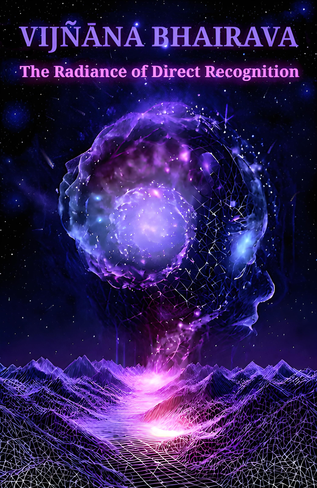

# Vijñāna Bhairava Tantra 
## The Radiance of Direct Recognition
### A contemporary translation

### Editorial Conventions

This edition of the Vijñāna Bhairava Tantra draws primarily from Swami
Lakshmanjoo's oral teachings, as preserved in Vijñāna Bhairava: The Practice of
Centring Awareness (originally translated by Bettina Bäumer with commentary by
Swami Lakshmanjoo). It refines that foundational material for contemporary
readers while honoring the living tradition of Kashmir Shaivism.
The translation and commentary were developed using a method termed self-
instructing iterative text diffusion: a structured, multi-cycle process in which the
language model generates, evaluates, and progressively refines each section
against internalized criteria: doctrinal fidelity, linguistic elegance, conceptual
precision, and experiential resonance. Unlike open-ended generation, this process
is grounded in a fixed, authoritative source text and cross-referenced against
additional primary materials (including unpublished transcripts, parallel Sanskrit
editions, and Lakshmanjoo’s other recorded discourses). This access to verified
source content enables the system to correct misinterpretations, resolve
ambiguities, and maintain terminological consistency across the entire tantra.
This approach is especially valuable for tasks demanding strict adherence to
doctrinal and stylistic parameters—such as rendering tantric terminology with
semantic integrity (visarga as “emission,” not “release”; vimala as “stainless,” not
merely “pure”) or expressing non-dual insights without falling into conceptual
reification. By anchoring each revision in concrete source evidence and applying
consistent interpretive guidelines derived from the Trika tradition, the process
approximates the precision of a trained practitioner’s expression, even when
working through the constraints of a digital medium.While iterative self-correction significantly enhances textual coherence and
alignment with historical teachings, soteriological depth cannot arise from
algorithmic refinement alone. To ensure the final rendering reflects not only
accuracy but also the living pulse of realization, the model was guided at critical
junctures—phrasing was adjusted, superficial interpretations were rejected, and
the output was consistently reoriented toward the non-conceptual heart of the
teaching. In this way, the model served as a responsive instrument, while
discernment, lineage awareness, and contemplative insight remained anchored in
direct human oversight.
When guided by reliable source material and curated by an experienced
practitioner, this method becomes a powerful tool for clarifying, organizing, and
conveying esoteric teachings with unusual fidelity where precision and accessibility
must coexist.

### Structure of Each Section
Each verse or group of verses follows this consistent format:
- [Devanagari] The original Sanskrit text appears in clean, standardized
Devanagari script, corrected from any prior transcription errors and aligned
with established scholarly editions.
- [IAST Romanized] A precise International Alphabet of Sanskrit Transliteration
(IAST) rendering includes full diacritics for accurate pronunciation and
scholarly reference.
- [Translation] The English translation prioritizes doctrinal fidelity to the non-
dual Trika perspective, combined with literary elegance, natural rhythm, and
clarity. It avoids overly literal stiffness or excessive paraphrase, aiming for a
rendering that is both poetically evocative and accessible to modern readers
without compromising the text's profound subtlety.
- [Lakshmanjoo's Transmission] This draws directly from Swami
Lakshmanjoo's spoken expositions. The original informal, oral style—delivered
in Q&A sessions—has been carefully edited for grammatical polish, flow, and
readability in English. Every substantive insight, explanation, and emphasis
from the Swami remains intact; only the expression has been refined to
enhance comprehension while preserving his direct, experiential voice.
- [Extended Commentary] This entirely new layer offers standalone reflections
in universal, non-sectarian language. It avoids references to specific lineages,
texts, or technical terminology, instead pointing timelessly and directly to the
verse's deepest meaning in a way that invites immediate insight and
recognition.Terminology and Style
- Key Sanskrit terms (e.g., Bhairava, Śakti, visarga) retain their original form on
first prominent appearance, with context providing implicit meaning rather
than glosses, to maintain the text's immersive quality.
- Consistent English equivalents have been chosen for recurring concepts (e.g.,
"plenitude" for states of fullness; "immersion" for absorptive realization;
"recognition" for direct awakening) to ensure thematic coherence across the
entire tantra.
- The translation and commentaries emphasize the text's core teaching: the
effortless revelation of innate wholeness through direct awareness, free from
contrived effort or conceptual overlay.

This edition seeks not merely to inform but to transmit—to serve as a living mirror
for the reader's own recognition of the ever-present reality celebrated in these
verses. It is offered with deep reverence to the tradition and to Swami
Lakshmanjoo, the last great master in its unbroken lineage.

### Translator's Invocation
When one glimpses that the boundless sky of awareness has never been confined
by the clouds of thought—that every breath, every sensation, every heartbeat is
already saturated with the luminous fullness of Bhairava—then, in that instant of
recognition, the world does not vanish but becomes transparent. This transparency
is not emptiness as absence, but as overflowing completeness—the seamless unity
of Śiva and Śakti dancing as the ordinary miracle of being.

Bhairava is not a deity to be worshipped elsewhere, but the unbroken wholeness of
the ground in which all appearances float like stars in empty sky. His form is not
shaped by concepts but revealed in the space between breaths, between thoughts,
between the outstretched arms and the void beneath them. He witnesses not as a
separate observer but as the very field of witnessing itself—prior to all division,
untouched by time's fire, free from the subtle contractions of "I" and "mine."
Bhairavī is not apart from him but is his dynamic face, the spontaneous pulse of
recognition that floods the heart when all seeking collapses. She is the 112
doorways, not as methods to perfect but as mirrors held up to what has always
been awake. Her nectar is not attained but tasted when the mind renders itself
supportless—when even the trace of spiritual ambition dissolves like salt in water.
This text does not lead to a destination but unmasks the illusion of having
departed. It is not a map but a mirror. Its words are not instructions but fingers
pointing to the luminous space where all instructions vanish. May this translation
not add another veil but become a window—clear, transparent, allowing the living
breath of the tantra to awaken the same recognition in you that has never
departed from you.

May the 112 gateways reveal not a path to walk but the ever-present ground on
which you already stand—as you are, here and now, utterly free.
